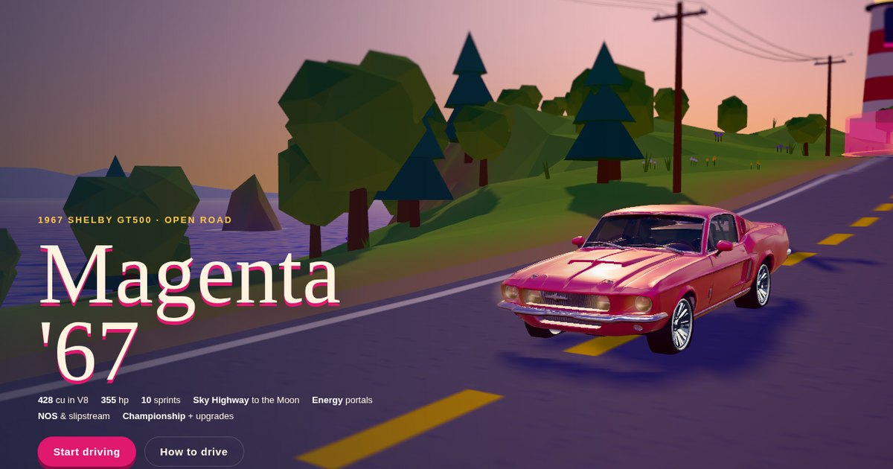

# Magenta '67

An open-world browser racing game by G-Data Labs. Drive a magenta 1967 fastback around a seaside island, up the Sky Highway to the Moon, and through energy portals that turn you into a ball of light.

- 10 sprint races against three rivals, plus a nine-round championship with car upgrades
- The Sky Highway: a launch rail into the clouds, a road to the Moon and a re-entry chute back to Earth
- Energy portals and Portal Rush: become an energy orb, drift for points, skim across the sea
- NOS, slipstreams, drift zones, speed traps, 25 hidden gold snakes, ghosts and replays
- Day, sunset and night; clear, fog and rain

## Controls

| | Keyboard | Gamepad |
|---|---|---|
| Drive | W A S D or arrows | Triggers + stick |
| Handbrake / drift (hop as the orb) | Space | B |
| NOS | Shift or N | LB |
| Camera | C | Y |
| Reset | R | X |
| Pause | Esc | Start |

On a phone, on-screen pedals and steering appear automatically.

## About this repo

This repo holds the playable build only: a static site with no build step. `index.html` loads `game.js` (the whole game, built with [three.js](https://threejs.org)) and the sounds in `sfx/`. It deploys to Vercel as is.

Sound effects, engine recordings, music and announcer lines were generated with ElevenLabs. The car model was made with Tripo from photos of a real magenta '67.
